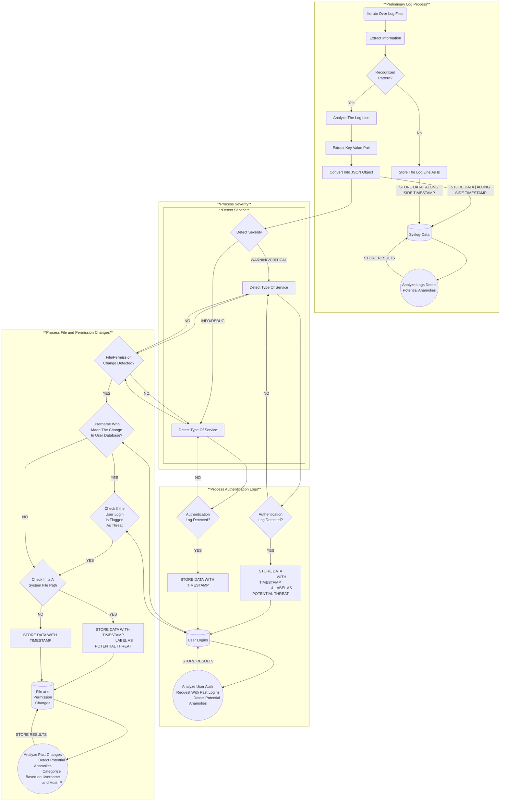

```mermaid
flowchart TB
  %% Preliminary Log Process
  subgraph "**Preliminary Log Process**"
    id1(Iterate Over Log Files) --> id2(Extract Information)
    id2(Extract Information) --> id3{"Recognized 
                                      Pattern?"}
    id3 -- No --> id5[Store The Log Line As Is]
    id3 -- Yes --> id4[Analyze The Log Line]
    id4 --> id6[Extract Key Value Pair]
    id6 --> id7[Convert Into JSON Object]
    id7 --STORE DATA | ALONG SIDE TIMESTAMP-->  id8[(Syslog-Data)]
    id5 --STORE DATA | ALONG SIDE TIMESTAMP-->  id8[(Syslog-Data)]
    id8 --> id9((Analyze Logs Detect 
                  Potential Anamolies))
    id9 --STORE RESULTS--> id8
  end
  %% Process Log Severity
  subgraph "**Process Severity**"
    id7 --> id10{"Detect Severity"}
    subgraph "**Detect Service**"
      id10 --WARNING/CRITICAL--> id11[Detect Type Of Service]
      id10 --INFO/DEBUG--> id12[Detect Type Of Service]
    end
  end
  %% Process Authentication Logs
  subgraph "**Process Authentication Logs**"
    id11 --> id13{"Authentication 
                  Log Detected?"}
    id13 --NO-->id11
    id13 --YES--> id14[STORE DATA
                      WITH TIMESTAMP 
                      & LABEL AS POTENTIAL THREAT] -->  id18[(User Logins)]
    id12 --> id15{"Authentication 
                  Log Detected?"}
    id15 --NO-->id12
    id15 --YES--> id16[STORE DATA WITH TIMESTAMP] --> id18
    id18 --> id20((Analyze User Auth Request With Past Logins
                  Detect Potential Anamolies))
    id20 --STORE RESULTS--> id18
  end

  %% Process File and Permission Changes
  subgraph "**Process File and Permission Changes**"
    id11 --> id21{"File/Permission 
                  Change Detected?"}
    id21 --NO--> id11
    id12 --> id21
    id21 --NO--> id12
    id21 --YES--> id22{"Username Who
                        Made The Change
                        In User Database?"}
    id22 <--> id18
    id22 --YES--> id23{Check If the 
                        User Login 
                        Is Flagged 
                        As Threat}
    id23 <--> id18
    id23 --YES--> id24{Check If Its A 
                      System File Path}
    id24 --YES--> id25[STORE DATA WITH TIMESTAMP
                      LABEL AS POTENTIAL THREAT] --> id28[(File and 
                                                            Permission 
                                                            Changes)]
    id22 --NO--> id24
    id24 --NO--> id26[STORE DATA WITH TIMESTAMP] --> id28
    id28 --> id27((Analyze Past Changes
                  Detect Potential Anamolies
                  Categorize Based on Username
                  and Host IP))
    id27 --STORE RESULTS--> id28
  end
```