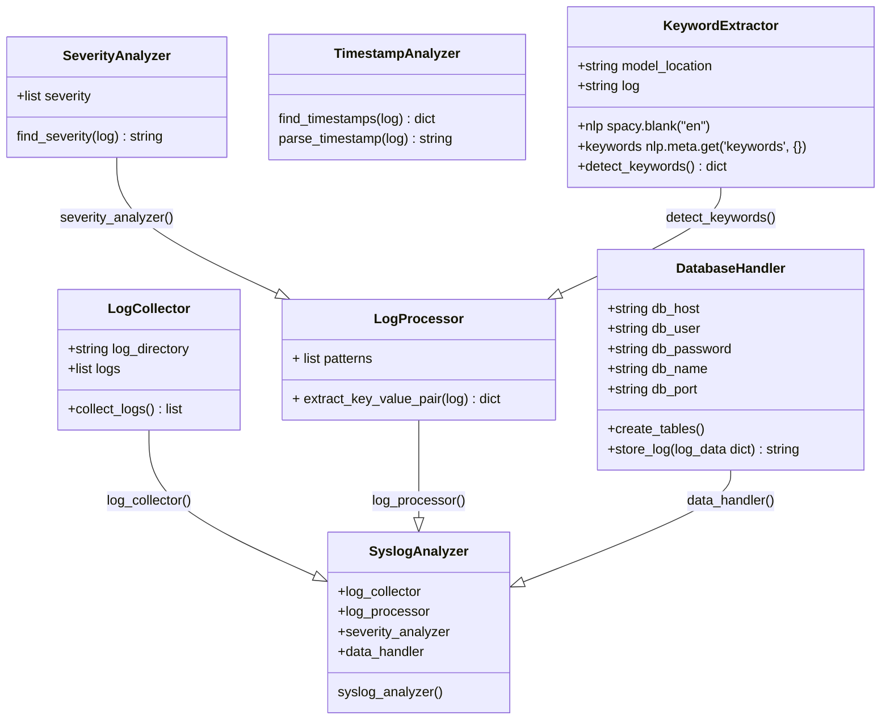

```mermaid
classDiagram
    class LogCollector
    LogCollector: +string log_directory
    LogCollector: +list logs
    LogCollector: +collect_logs() list

    class SeverityAnalyzer
    SeverityAnalyzer: +list severity
    SeverityAnalyzer: find_severity(log) string

    class TimestampAnalyzer
    TimestampAnalyzer: find_timestamps(log) dict
    TimestampAnalyzer: parse_timestamp(log) string

    class KeywordExtractor
    KeywordExtractor: +string model_location
    KeywordExtractor: +string log
    KeywordExtractor: +nlp spacy.blank("en")
    KeywordExtractor: +keywords nlp.meta.get('keywords', {})
    KeywordExtractor: +detect_keywords() dict

    class LogProcessor
    LogProcessor: + list patterns
    LogProcessor: + extract_key_value_pair(log) dict

    SeverityAnalyzer --|> LogProcessor: severity_analyzer()
    KeywordExtractor --|> LogProcessor: detect_keywords()

    class DatabaseHandler
    DatabaseHandler: +string db_host
    DatabaseHandler: +string db_user
    DatabaseHandler: +string db_password
    DatabaseHandler: +string db_name
    DatabaseHandler: +string db_port
    DatabaseHandler: +create_tables()
    DatabaseHandler: +store_log(log_data dict) string

    class SyslogAnalyzer
    SyslogAnalyzer: +log_collector
    SyslogAnalyzer: +log_processor
    SyslogAnalyzer: +severity_analyzer
    SyslogAnalyzer: +data_handler
    SyslogAnalyzer: syslog_analyzer()
    
    LogCollector --|> SyslogAnalyzer: log_collector()
    LogProcessor --|> SyslogAnalyzer: log_processor()
    DatabaseHandler --|> SyslogAnalyzer: data_handler()
```